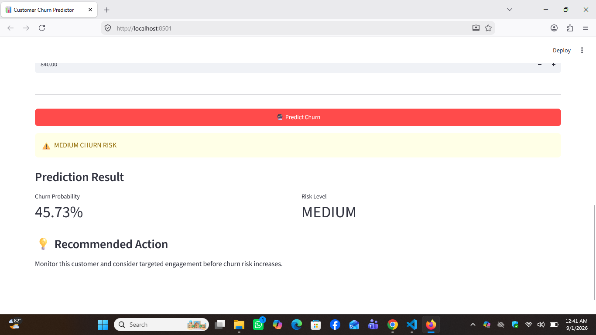

# 📊 Customer Churn Prediction

[](https://www.python.org/)
[](https://streamlit.io/)
[](https://scikit-learn.org/)
[](https://xgboost.readthedocs.io/)

An end-to-end Machine Learning project that predicts the probability of customer churn in the telecommunications industry.

The project covers the complete machine learning workflow, including data preprocessing, exploratory data analysis, model comparison, hyperparameter tuning, threshold optimization, cross-validation, model evaluation, and deployment through an interactive Streamlit web application.

---

## 🚀 Live Demo

👉 **Live Streamlit Application:**

https://ml-churn-prediction-jf5my7g32mstcnhsf4wyul.streamlit.app/

---

## 🖥️ Application Preview



---

## 🎯 Project Objective

Customer churn is an important business problem in the telecommunications industry.

The objective of this project is to build a machine learning system that can:

- Predict customer churn probability
- Identify customers at high risk of leaving
- Compare multiple classification algorithms
- Optimize the prediction threshold
- Evaluate model performance using multiple metrics
- Provide an easy-to-use prediction interface
- Support proactive customer retention strategies

---

## 📂 Dataset

The project uses the **Telco Customer Churn** dataset.

### Dataset Information

- **Total customers:** 7,043
- **Features:** 19
- **Target:** Churn
- **Numerical features:** 4
- **Categorical features:** 15

### Target Distribution

| Churn | Customers |
|---|---:|
| No | 5,174 |
| Yes | 1,869 |

The dataset contains customer demographic information, service subscriptions, contract information, payment methods, tenure, and billing information.

---

## 🧹 Data Preprocessing

The following preprocessing steps were performed:

- Missing value handling
- Data type conversion
- Separation of features and target
- Numerical feature preprocessing
- Categorical feature encoding
- Train-test split
- Stratified sampling to preserve the churn ratio
- Pipeline-based preprocessing to ensure consistent transformations

### Numerical Features

- SeniorCitizen
- tenure
- MonthlyCharges
- TotalCharges

### Categorical Features

- gender
- Partner
- Dependents
- PhoneService
- MultipleLines
- InternetService
- OnlineSecurity
- OnlineBackup
- DeviceProtection
- TechSupport
- StreamingTV
- StreamingMovies
- Contract
- PaperlessBilling
- PaymentMethod

---

## 🤖 Machine Learning Models

Three classification algorithms were evaluated:

1. **Logistic Regression**
2. **Random Forest**
3. **XGBoost**

Each model was evaluated using:

- Accuracy
- Precision
- Recall
- F1 Score
- ROC-AUC

---

## 📈 Model Comparison

| Model | Accuracy | Precision | Recall | F1 Score | ROC-AUC |
|---|---:|---:|---:|---:|---:|
| Logistic Regression | 0.8070 | 0.6604 | 0.5615 | **0.6069** | **0.8422** |
| Random Forest | 0.7743 | 0.5648 | **0.6524** | 0.6055 | 0.8271 |
| XGBoost | 0.7956 | 0.6473 | 0.5053 | 0.5676 | 0.8404 |

### Selected Model

**Logistic Regression**

The baseline Logistic Regression model achieved the highest F1 Score and ROC-AUC among the evaluated models at the default classification threshold of **0.50**.

Random Forest achieved higher recall, making it more suitable when the primary objective is to identify as many potential churners as possible.

---

## 🔬 Cross-Validation

A **5-Fold Stratified Cross-Validation** was performed to evaluate the consistency of the model across different validation folds.

| Metric | Mean ± Std |
|---|---:|
| Accuracy | 0.8030 ± 0.0125 |
| Precision | 0.6552 ± 0.0284 |
| Recall | 0.5445 ± 0.0407 |
| F1 Score | 0.5941 ± 0.0303 |
| ROC-AUC | **0.8462 ± 0.0126** |

The cross-validation results indicate that the model provides relatively consistent performance across different validation folds.

---

## ⚙️ Hyperparameter Tuning

**GridSearchCV** was used to optimize the Logistic Regression model.

### Best Parameters

```text
C = 100
solver = liblinear
